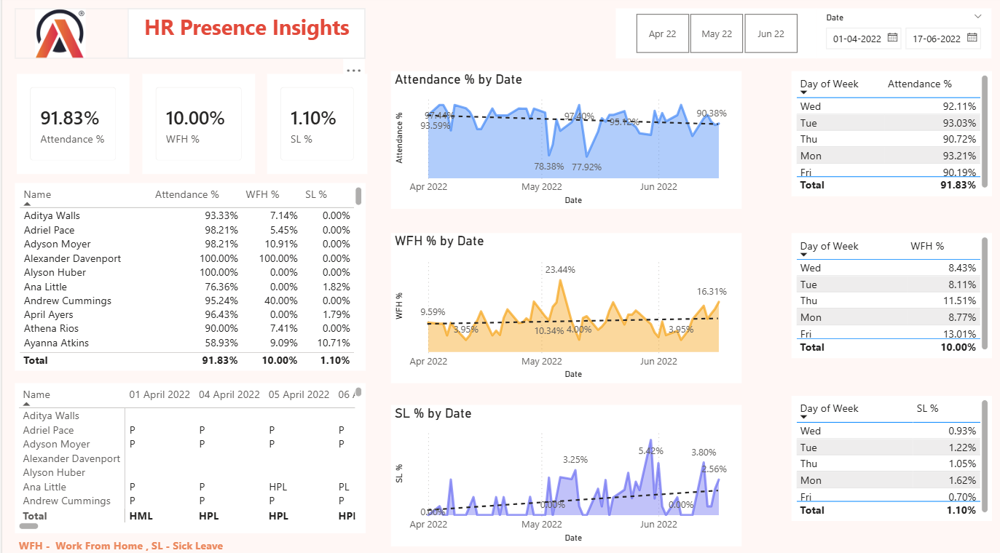
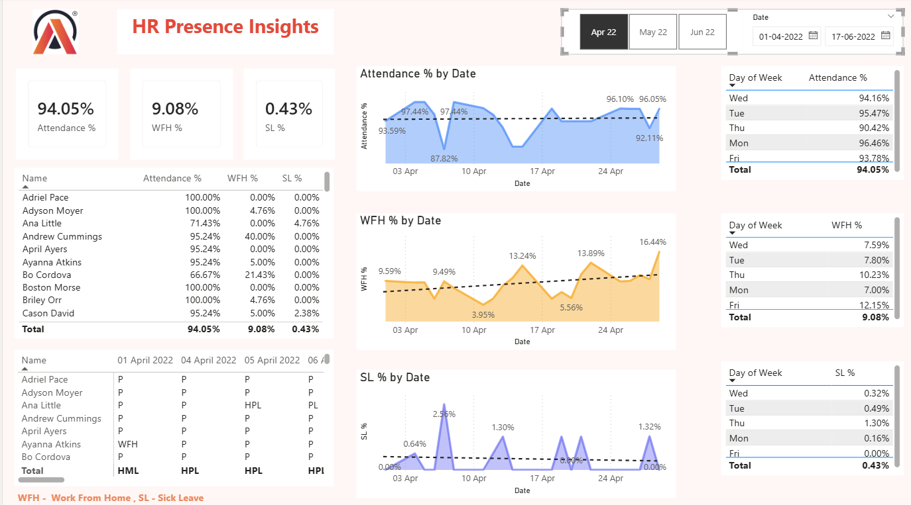
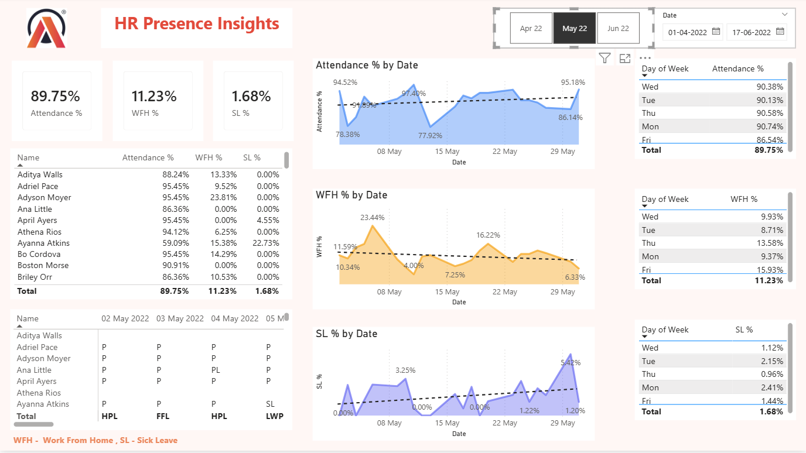
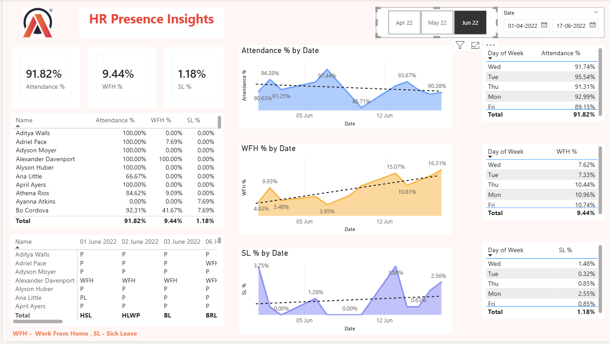

# HR Analytics Dashboard – Presence & Workforce Insights

## 📌 Overview
Interactive Power BI dashboard analyzing employee attendance, Work From Home (WFH), Work From Office (WFO), and Sick Leave (SL) patterns to support HR decision-making and workforce planning.

---

## 🛠 Tools Used
- Power BI  
- Power Query  
- DAX  
- Excel (Attendance Data)

---

## 📊 Key KPIs
- Attendance %
- WFH %
- Sick Leave %

---

## 📈 Insights Delivered
- Attendance trends by date and day of week  
- WFH vs WFO behavior patterns  
- Sick leave spikes for wellness monitoring  
- Employee-level attendance analysis  

---

## 💡 Business Impact
- Enabled data-driven workforce planning  
- Supported infrastructure cost optimization  
- Improved visibility into absenteeism risks  

---

## 📷 Dashboard Preview

### Overall Dashboard


### Monthly Views

**April 2022**


**May 2022**


**June 2022**


---

## 📂 Repository Structure

```text
HR-Analytics-PowerBI-Dashboard/
├── Dataset/
├── PowerBI/
├── Screenshots/
│   ├── dashboard_overview.png
│   ├── dashboard_apr_2022.png
│   ├── dashboard_may_2022.png
│   └── dashboard_june_2022.png
└── README.md
```


